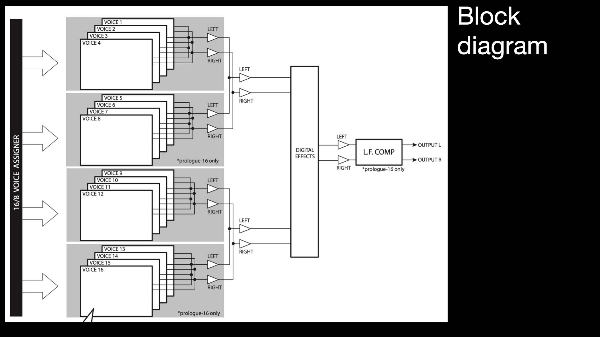
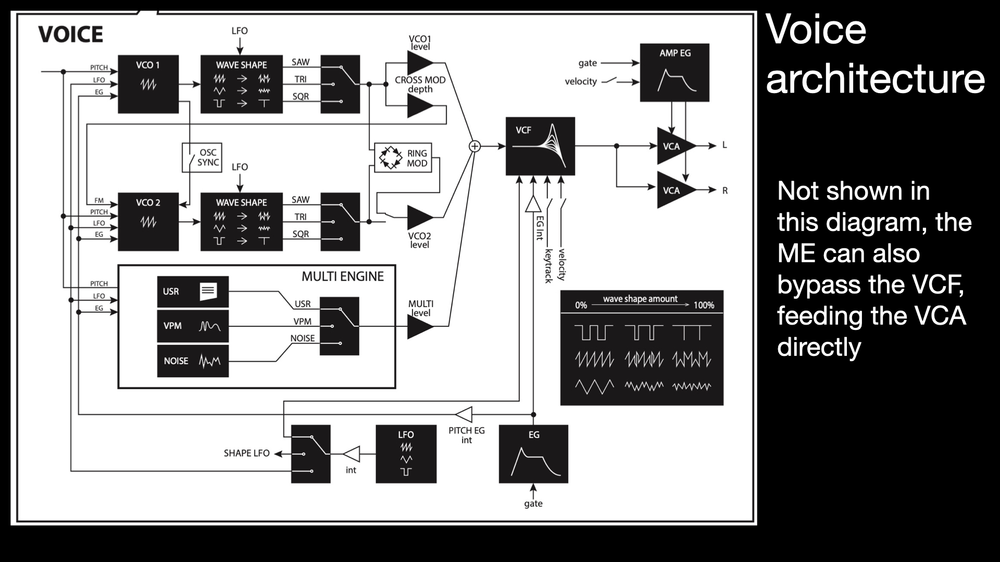
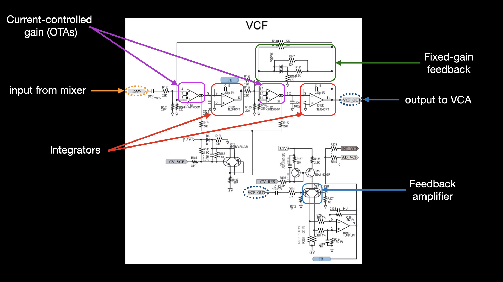
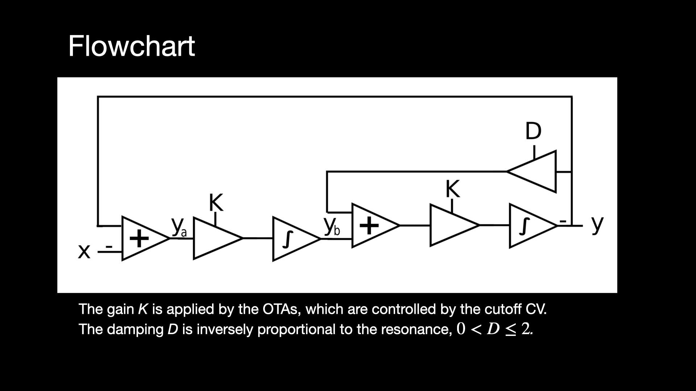

In 2018 Korg released, somewhat unexpectedly, a polyphonic synthesizer,
in 8 and 16-voice variants, called the Prologue.This was special on
many counts, among these we may cite

* It has three oscillators, two VCOs and a digital oscillator (the
multiengine, ME). At the time, this was only the second 16V analogue synthesizer
with VCOs ever made into mass production (the other one was Alesis'
Andromeda from the early 2000s).
* The ME was programmable and an SDK was made available for anyone to
do it.
* It had a digital effects section that was also programmable.

It suffered from the design decision of
putting the full analogue signal through an ADC/DAC to implement
the digital effects with no true analogue route to the
output.

 </img>

Interestingly enough, an examination of the service manual documents
shows that at some point an effects bypass was present in the design,
but that seems to have been removed later on.

The prologue also had some limitations in terms of modulation with
only one LFO per voice.

However that was also the case of many classic VCO polysynths.

The Prologue now seems to be discontinued and it is slowly
turning into a highly desirable instrument. Some of its character has to be
attributed to the VCF it employs. This appears to be a novel origin
design (I have not seen anything similar yet), contrary to the other
logue-line synths, which use more conventional 4-pole lowpass
types.

The VCF circuit
-----

The Prologue VCF is advertised as a 2-pole lowpass filter, and as
we are accustomed to see these tend to be of the state-variable
type. A look at the circuit diagram makes us believe that, since
we can find a couple of integrators following VC gain units.

However, if we draw a flowchart from this, we will see that the
damping feedback control is not placed in the usual location for
a state variable. In that classic design, it runs from the first integrator
back to the input.

Here, it runs from the output to before the second
gain unit.

A close analysis shows that this is still equivalent to a
state-variable lowpass, but it results on a reversed-polarity output.
It is of course the case that the topology of the state variable
filter can be tweaked to get some variants, and this confirms
that. Interestingly enough, it is possible to extract high-pass
and band-pass outputs from this filter (at the ya and yb points,
respectively), but this is not realised in the synthesizer.

The Prologue allows the ME signal to bypass the filter, so we can
test this conclusion. Plotting the input and output waveforms
confirms this.

Non-linearities
------------

The Prologue is anectotically known for its grit with high-resonance
settings. We should anticipate that this results from filter
non-linearities introduced by the CA3080 OTAs, which provide
the VCc-controlled gain responsible for setting the cutoff
frequency, and the differential amplifier used to control the
damping feedback level and the resonance amount.

We can clearly see these non-linearities having an effect on the
synthesizer output, for resonance levels above 50%,

As we can observe, a number of subsidiary peaks at multiples of
the filter frequency are present. In a linear 2-pole filter we should
only see one peak, but in this case, the filter is actually working as
a waveshaper, adding components to the spectrum.

The Prologue VCF is a very interesting filter and it really makes the
synthesizer produce tones that are different from other such
instruments. Together with other distinguishing features, it turns
this synth into a real modern classic.

